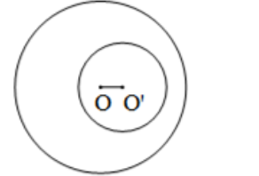
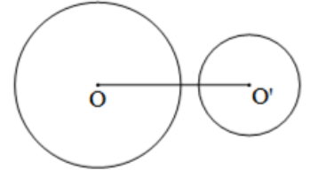
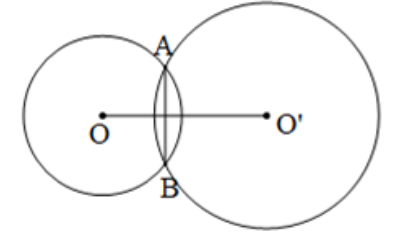
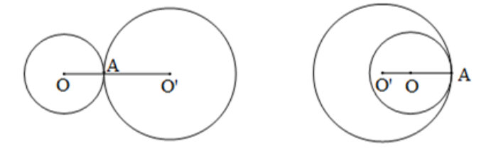

Một đường tròn trong mặt phẳng tọa độ O(x,y) được quản lý bởi 3 giá trị thuộc tính, x, y, và R.

Cho file dữ liệu theo định dạng sau:

-   Dòng 1: số nguyên N chỉ số lượng đường tròn có trong file

-   Dòng 2 đến dòng N+1: mỗi dòng đại diện cho đường tròn có định dạng (x,y,r)
    Ví dụ: nội dung sau đại diện cho file data có 5 đường tròn
    5
    0 0 5
    1 1 2
    1 1 5
    0 0 3
    10 10 2

Vị trí tương đối của các đường tròn quy ước như sau:
• Hai đường tròn rời nhau:
Hai đường tròn nằm rời nhau nếu khoảng cách giữa hai tâm đường tròn lớn hơn tổng các bán kính hai đường tròn.



• Hai đường tròn cắt nhau tại 2 điểm:
Hai đường tròn cắt nhau tại hai điểm nếu khoảng cách giữa hai tâm đường tròn nhỏ hơn tổng các bán kính hai đường tròn và lớn hơn hiệu các bán kính hai đường tròn.



• Hai đường tròn tiếp xúc:
Hai đường tròn tiếp xúc (giao nhau tại một điểm) nếu khoảng cách giữa hai tâm đường tròn bằng tổng các bán kính hai đường tròn hoặc bằng hiệu các bán kính hai đường tròn.



• Đường tròn này chứa đường tròn kia
Đường tròn nhỏ hơn nằm trong đường tròn lớn hơn nếu khoảng cách giữa hai tâm đường tròn nhỏ hơn hiệu các bán kính hai đường tròn.



Viết chương trình thực hiện các công việc sau:
Câu 1: Cài đặt lớp Circle
gồm các thành viên như sau:

```bash
class Circle {
protected:
    int x, y; //tâm
    int r;//bán kính
public:
    Circle(); //Hàm khởi tạo không có tham số, tạo Circle mặc định (0,0,1)
    Circle(int x0, int y0, int r0);//Hàm khởi tạo có 3 tham số
    Circle(int r);//Ham khoi tao 1 tham so, tạo Circle (0,0,r)
    Circle(const Circle& p); //copy constructor
//hàm get đã cài đặt sẵn
    int getX() const { return x; }
    int getY() const { return y; }
    int getR() const { return r; }
    //Toán tử chèn, xuất theo dạng (x,y,r)
    friend ostream& operator<< (ostream& out, const Circle& p);
//Toán tử tách, cho phép nhập 1 đường tròn dạng (x,y,r)
    friend istream& operator>> (istream& in, Circle& p);
    //Toán tử - tính khoảng cách tâm, c1-c2 là khoảng cách giữa 2 tâm của c1 và c2
    friend double operator-(const Circle& p1, const Circle& p2);
    //Toán tử ==,!= dùng để kiểm tra 2 đường tròn có trùng tâm/khác tâm hay không
    friend bool operator==(const Circle& p1, const Circle& p2);
    friend bool operator!=(const Circle& p1, const Circle& p2);
// So sánh 2 bán kính, dùng để sắp xếp
    bool operator<(const Circle& p) const;
    // Các toán tử đặc biệt: ^, |, &, % dùng để kiểm tra vị trí tương đối của hai đường tròn (chỉ chọn 1 theo yêu cầu cụ thể)
    //c1^c2 : kiểm tra c1 tiếp xúc c2
    // c1|c2 : kiểm tra c1 nằm rời c2
    //c1&c2 : kiểm tra c1 cắt c2
    //c1%c2 : kiểm tra c2 có nằm trong c1
};
```

Câu 2: Mở rộng Circle

Một Ring bao gồm 2 đường tròn có chung tâm và khác bán kính.

Cài đặt lớp Ring kế thừa từ lớp Circle, với bổ sung thêm một bán kính r2>r.

a) Cài đặt hàm khởi tạo

Ring(int x, int y, int r, int r2);

Ring(const Circle& c1, int r2); //tạo ring có x, y của c1, và hai bán hính là bán kính của c1 và r2

//Lưu ý đảm bảo bán kính r2 luôn lớn hơn r, nếu r2 < r thì đảo giá trị lại

b) Cài đặt lại toán tử chèn << xuất theo định dạng chuỗi là (x,y,r,r2), cài đặt lại toán tử tách >> nhận 4 số nguyên liên tiếp cho x, y, r, và r2.

c) Cài đặt lại toán tử đặc biệt ^, |, &, và & với 2 Ring

Cài đặt dựa trên vị trí tương đối của hai đường tròn bao ngoài của 2 Ring (chỉ cài đặt 1 toán tử theo yêu cầu cụ thể)

d) Cài đặt phương thức width() để tính độ dày của ring (hiệu của hai bán kính)

Câu 3: Sử dụng lớp Circle và Ring

Gồm 4 câu: a, b, c, d

Thực hiện theo các yêu cầu cụ thể.

Câu a

Cài đặt lớp Circle theo đặc tả như sau:

**Các tệp được yêu cầu**

Circle.h
```bash
#pragma once
#include <iostream>
#include <math.h>
using namespace std;
class Circle {
protected:
	int x, y;
	int r;//bán kính
public:
	Circle(); //Hàm khởi tạo không có tham số, tạo Circle mặc định (0,0,1)
	Circle(int x0, int y0, int r0);//Hàm khởi tạo có 3 tham số
	Circle(int r);//Ham khoi tao 1 tham số, tạo Circle (0,0,r)
	Circle(const Circle& p); //copy constructor
    //hàm get đã cài đặt sẵn
	int getX() const { return x; }
	int getY() const { return y; }
	int getR() const { return r; }
	//Toán tử chèn, xuất theo dạng (x,y,r)
	friend ostream& operator<< (ostream& out, const Circle& p);
    //Toán tử tách, cho phép nhập 1 đường tròn dạng (x,y,r)
	friend istream& operator>> (istream& in, Circle& p);
	//Toán tử - tính khoảng cách tâm, c1-c2 là khoảng cách giữa 2 tâm của c1 và c2
	friend double operator-(const Circle& p1, const Circle& p2);
	//Toán tử ==,!= dùng để kiểm tra 2 đường tròn có trùng tâm/khác tâm không
	friend bool operator==(const Circle& p1, const Circle& p2);
	friend bool operator!=(const Circle& p1, const Circle& p2);
    // So sánh 2 bán kính, dùng để sắp xếp
	bool operator<(const Circle& c2) const;// trả về true nếu bán kính bé hơn bán kính đường tròn c2
	
	// Các toán tử sau dùng để kiểm tra vị trí tương đối của hai đường tròn
	bool operator^(const Circle& c2) const;//kiểm tra đường tròn này có tiếp xúc với đường tròn c2

};
```

Circle.cpp

```bash
#include "Circle.h"
```

Câu b

Cài đặt lớp Ring kế thừa từ Circle theo đặc tả như sau:

**Các tệp được yêu cầu**

Ring.h

```bash
#pragma once
#include "Circle.h"
class Ring : public Circle {
protected:
	int r2;
public:
	int getR2()const { return r2; }

	Ring(int x, int y, int r, int r2);//Khởi tạo Ring có tâm (x,y) và hai bán kính r và r2 (đảm bảo r<=r2, nếu ngược lại thì hoán đổi)
	Ring(const Circle& c1, int r2); //Khởi tạo Ring có tâm của c1 và bán kính r của c1 và r2
	// Lưu ý: với hàm khởi tạo cần đảm bảo r<=r2, nếu ngược lại thì hoán đổi.

	friend ostream& operator<<(ostream& out, const Ring& p); //Xuất Ring theo dạng (x,y,r,r2)
	int width() const;//Độ dày của Ring (hiệu của 2 bán kính)

	//Cài đặt lại các toán tử đánh giá vị trí tương đối của hai Ring theo yêu cầu
	//vị trí tương đối của 2 Ring được đánh giá qua 2 đường tròn bao ngoài của các Ring đó (các đường tròn có bán kính lớn r2)
};
```

```bash
#include "Ring.h"
```

Câu c

**Các tệp được yêu cầu**

a) Đọc một file theo định dạng mô tả ở trên, xuất ra màn hình các đường tròn đọc được, mỗi đường tròn trên một dòng và sắp xếp theo bán kính tăng dần.

b) Xuất ra màn hình các đường tròn chứa trong file có tiếp xúc với ít nhất một đường tròn khác.

c) Xuất ra màn hình tổng số Ring tạo được từ các đường tròn trong file, biết rằng hai đường tròn tạo được thành Ring nếu chúng có cùng tâm và khác bán kính.

d) Xuất ra màn hình (các) Ring có độ dày lớn nhất.

CircleProblems.h

```bash
#pragma once
#include <string>
using namespace std;

class CircleProblems {
public:
	static void ProblemA(const string filename);//Cài đặt yêu cầu a)
	static void ProblemB(const string filename);//Cài đặt yêu cầu b)
	static void ProblemC(const string filename);//Cài đặt yêu cầu c)
	static void ProblemD(const string filename);//Cài đặt yêu cầu d)
};
```

CircleProblems.cpp

```bash
#include "CircleProblems.h"
#include "Circle.h"
#include "Ring.h"
```